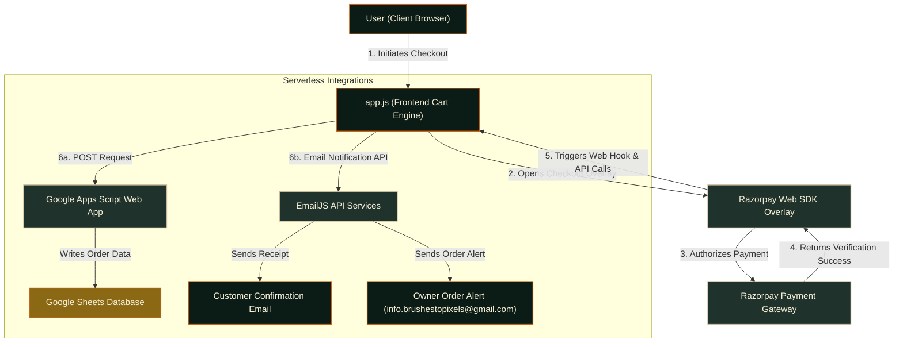

# BrushestoPixels — Handcrafted Home Décor

Welcome to the frontend repository for **BrushestoPixels**, a premium e-commerce platform showcasing handcrafted luxury home décor, bespoke paintings, artisan shakers, and curated design objects created by artist and founder **Yashwardhan Singh Sayla**.

Each piece tells a unique story, crafted with deep intention, beauty, and premium materials.

---

## ✨ Features

* **Premium Aesthetic Design**: A curated dark-mode color palette (`#0B1C16` forest green, amber, and cream accents) using glassmorphism, floating micro-animations, and elegant typography (Cormorant Garamond, Jost, and Dancing Script).
* **Interactive Product Cards**:
  * Multi-image product carousels with smooth fade-and-zoom transitions.
  * Mobile-optimized swipe gestures that transition images horizontally while allowing vertical page scrolling.
* **Bespoke Product Stories**: Expandable story sections detailing the origin story, materials, dimensions, and custom tags for each art piece.
* **Fluid Shopping Cart Sidebar**: Sliding cart overlay supporting item quantities, dynamic shipping fee calculations, and automated checkout transitions.
* **Full-Screen Lightbox**: High-resolution image browser with keyboard controls, swipe gestures, tap-to-close, and optimized mobile viewport behavior.
* **Interactive Mascot**: An animated tiger mascot that speaks, reacts to user gestures (dragging, petting), and celebrates cart additions.

---

## 🔌 Integrations & Automated Order Flows

To handle order management without a complex database backend, the site uses an elegant, serverless integration flow upon successful payment verification:



1. **Razorpay Web SDK**: Implements secure checkout and process payments directly from the client.
2. **EmailJS Notification Loop**: Triggers dual asynchronous emails:
   * **Customer Confirmation**: Sends a personalized receipt detailing their order ID, ordered items, and shipping address.
   * **Owner Alert**: Sends a separate transaction summary to `info.brushestopixels@gmail.com` with complete order details (items, prices, customer phone, email, and Razorpay Payment ID).
3. **Google Sheets Integration**: Automatically logs every verified transaction to a Google Spreadsheet using a Google Apps Script Web App POST hook, providing instant fulfillment tracking.

---

## 🛠️ Technical Implementation & Architecture

This website was architected and developed by **Aditya Pratap Singh** as a high-fidelity, high-performance multi-page website designed to load instantly and behave with native-like responsiveness.

### 💻 Languages & Technologies Used

* **HTML5**: Structured semantically for optimal search engine visibility (SEO) and accessibility (ARIA roles). Implements Schema.org Structured Data (`ld+json`) for rich search engine indexing.
* **CSS3**: 
  * Uses **CSS Custom Properties** (Variables) for modular, maintainable styles.
  * Employs **CSS Grid** and **Flexbox** layouts to build card grids that stack dynamically across desktop, tablet, and mobile screens.
  * Features GPU-accelerated transition animations (`will-change: transform`) and customized keyframe transitions.
* **Vanilla JavaScript (ES6+)**: Handles active website states, shopping cart calculations, lightbox slider index management, and overlay toggles without heavy framework overhead, keeping the bundle size near-zero.
* **Interactive Mascot Engine**: Custom JavaScript event loops control the animated tiger companion (`brushesCat`), triggering visual state changes, speech bubble transitions, drag-to-move physics, and site-wide event hooks.

---

## 🚀 Getting Started

Since this project is built as a multi-page website with zero external build tool requirements, it is lightweight and ready to run.

### Running Locally

1. Clone the repository:
   ```bash
   git clone https://github.com/Aditya-is-AFK25/website-front-end.git
   ```
2. Open the directory:
   ```bash
   cd website-front-end
   ```
3. Run a local development server to serve the page:
   * using **Python**:
     ```bash
     python -m http.server 8000
     ```
   * using **Node.js (npx)**:
     ```bash
     npx http-server
     ```
4. Access the site in your browser at `http://localhost:8000` (or the port specified by the server).

---

## 🔧 Recent Performance & Feature Updates

* **Google Sheets order database**: Configured the checkout callback to post order logs dynamically to a Google Spreadsheet via Apps Script.
* **Dual Email notifications**: Integrated EmailJS to automatically trigger customer receipt copies and owner order alerts in parallel.
* **Mobile Scrolling Fixes**: Resolved layout blockages inside `.product-story-inner` on iOS Safari and Android Chrome by removing conflicting parent scroll settings and resolving CSS specificity overrides during `:hover` card states.
* **Swipe-to-Scroll UX**: Optimized horizontal swipe gesture checks to ensure vertical page-scrolling gestures are completely ignored by the image carousel listeners.
* **Fixed Position Restorations**: Removed `transform` overrides on the `body` page-load keyframes to keep the navigation bar and shopping cart overlay locked to the viewport coordinates rather than leaking layout space.

---

## 👤 Developer & Project Credits

* **Lead Software Engineer / Developer**: **Aditya Pratap Singh**
  * Responsibilities: Front-end architecture, responsive design system, multi-image slider swipe gestures, interactive Mascot logic, payment gateways, contact APIs, Google Sheets integrations, and core viewport debugging (mobile scrolling, coordinate containing blocks, etc.).
  * GitHub: [@Aditya-is-AFK25](https://github.com/Aditya-is-AFK25)

* **Founder & Artist**: **Yashwardhan Singh Sayla**
  * Concept developer, collection designer, and creator of the product stories.
  * Website: [brushestopixels.in](https://brushestopixels.in)
